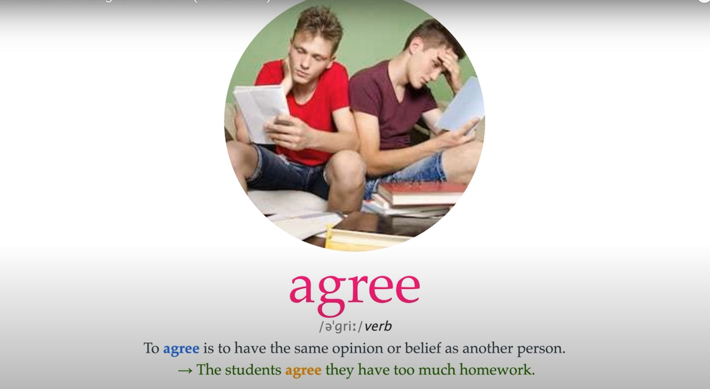

# Agree

## Image



## Definition

> To agree is to have the same opinion or belief as another person.

## Sentences

```md
Agree

To agree is to have the same opinion or belief as another person.

The students agree they have too much homework

Ann and I never seem to agree.

I agree with you on this issue.

My father and I don't agree about/on very much.

[ + that ] I agree that he should be invited.

[ + question word ] Experts seem unable to agree whether the drug is safe or not.

[ + speech ] "You're absolutely right," agreed Jake.
```
